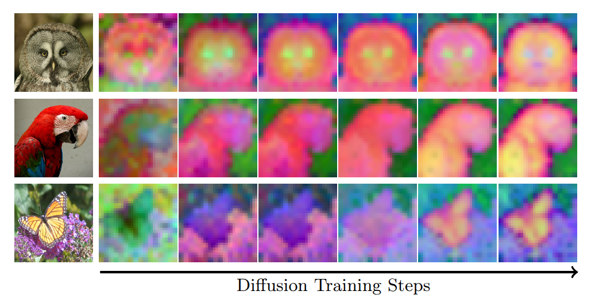

<!--             
<style>
  .texttt {
    font-family: Consolas; /* Monospace font */
    font-size: 1em; /* Match surrounding text size */
    color: teal; /* Add this line to set text color to blue */
    letter-spacing: 0; /* Adjust if needed */
  }
</style> -->

<h1 align="center">
   Coevolving Representations in
  <br> Joint Image-Feature Diffusion 

</h1>


<div align="center">
  <a href="https://scholar.google.com/citations?user=a5vkWc8AAAAJ&hl=en" target="_blank">Theodoros&nbsp;Kouzelis</a><sup>1,3</sup> &ensp; <b>&middot;</b> &ensp;
  <a href="https://scholar.google.fr/citations?user=7atfg7EAAAAJ&hl=en" target="_blank">Spyros&nbsp;Gidaris</a><sup>2</sup> &ensp; <b>&middot;</b> &ensp;
  <a href="https://scholar.google.com/citations?user=xCPoT4EAAAAJ&hl=en" target="_blank">Nikos&nbsp;Komodakis</a><sup>1,4,5</sup>  
  <br>
  <sup>1</sup> Archimedes/Athena RC &emsp; <sup>2</sup> valeo.ai &emsp; <sup>3</sup> National Technical University of Athens &emsp; <br>
  <sup>4</sup> University of Crete &emsp; <sup>5</sup> IACM-Forth &emsp; 
<p align="center">
  <a href="https://arxiv.org/abs/2604.17492">📃 Paper</a> &ensp;
  <br><br>
</p>




</div>

Code and pretrained models will be released soon. Stay tuned!


# Citation
If you found CoReDi useful in your research, please consider starring ⭐ us on GitHub and citing 📚 us in your research!

```bibtex
@article{kouzelis_coredi2026,
  title={Coevolving Representations in Joint Image-Feature Diffusion},
  author={Kouzelis, Theodoros and Gidaris, Spyros and Komodakis, Nikos},
  journal={arXiv preprint arXiv:2604.17492},
  year={2026}
}
```

